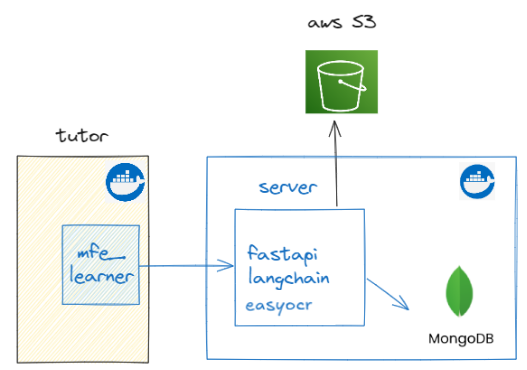
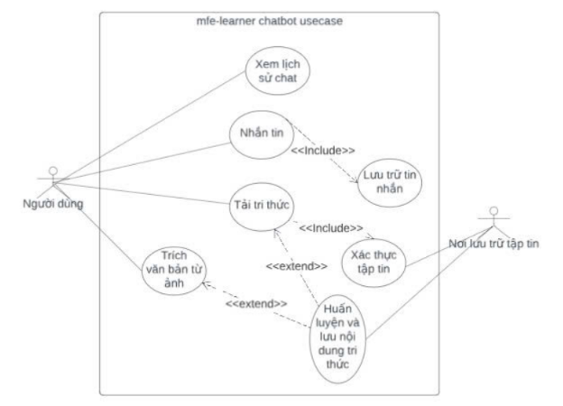
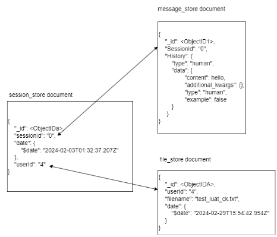
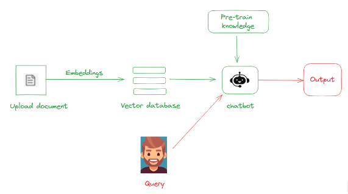

<a id="readme-top"></a>

<!-- PROJECT LOGO -->
<br />
<div align="center">
  <a href="https://github.com/thetansabe/frontend_app_learner">
    
  </a>

  <h3 align="center">Chatbot Server</h3>

  <p align="center">
    <a href="https://docs.google.com/document/d/18hVomCJ_LPs2bTCooNbRvz-M_LR8pnd6/edit?usp=sharing&ouid=107337327725163773984&rtpof=true&sd=true"><strong>Explore the docs »</strong></a>
    <br />
    <br />
    <a href="https://youtu.be/R-9tuvLTDB4">View Demo</a>
    &middot;
    <a href="https://github.com/thetansabe/frontend_app_learner">Visit Chatbot UI</a>
    &middot;
    <a href="https://github.com/S1mpleOW/openedx-aws-tf">Visit AWS deployment</a>
  </p>
</div>

<!-- Table of Contents -->
<details>
  <summary>Table of Contents</summary>
  <ol>
    <li>
      <a href="#about-the-project">About The Project</a>
      <ul>
        <li><a href="#built-with">Built With</a></li>
      </ul>
    </li>
    <li>
      <a href="#getting-started">Getting Started</a>
      <ul>
        <li><a href="#prerequisites">Prerequisites</a></li>
        <li><a href="#installation">Installation</a></li>
      </ul>
    </li>
     <li><a href="#usage">Usage</a></li>
  </ol>
</details>

<!-- ABOUT THE PROJECT -->

## About The Project

Installing the open-source edX platform, using a micro-frontend architecture to integrate a chatbot application into the LMS platform. This enhances the developer experience for contributing to the open-source code and adds new AI features that edX currently lacks.

In the demo, you can see that our chatbot app can reuse uri, themes and components from edX Tutor, such as the header bar and authentication page.

<p align="right">(<a href="#readme-top">back to top</a>)</p>

### Built With

- ![React][React.js]
- ![Python][Python.org]
- ![Open edX][Open edX]
- ![MongoDB][MongoDB]
- ![ChromaDB][ChromaDB]
- ![Langchain][Langchain]

<p align="right">(<a href="#readme-top">back to top</a>)</p>
<!-- GETTING STARTED -->

## Getting Started

Setting up Tutor EdX and the chatbot application requires some prerequisites and installation steps. Follow the instructions below to get started.

### Prerequisites

1. Make sure you read the [setup guide](https://github.com/thetansabe/frontend_app_learner)

2. Get your own GG_API_KEY from [Google AI studio](https://aistudio.google.com/app/apikey)

3. Get your own SEARCH_API_KEY from [Search API](https://www.searchapi.io/)

(Please provide these keys when you build docker, you can add them in docker-compose.yml file)

### Installation

Run project with Docker:

```bash
docker compose up -d
```

Or, run project locally:

```bash
pip install -re req.txt
python index.py
```

<p align="right">(<a href="#readme-top">back to top</a>)</p>
<!-- USAGE EXAMPLES -->

## Usage

#### Minimized architecture



#### Usecases



Some of use cases for the chatbot include: View chat history, Send messages, Upload knowledge, Validate content, Train and save the content, and Extract text from image.

#### Database schema



#### RAG flow



This diagram shows a chatbot system that uses a Retrieval-Augmented Generation (RAG) approach. It processes an uploaded document by converting it into numerical embeddings and storing them in a vector database. When a user submits a query, the system retrieves relevant information from the database and uses it, along with the chatbot's pre-trained knowledge, to generate a precise and informed output.

<!-- MARKDOWN LINKS & IMAGES -->

[React.js]: https://img.shields.io/badge/React-20232A?style=for-the-badge&logo=react&logoColor=61DAFB
[Python.org]: https://img.shields.io/badge/Python-3776AB?style=for-the-badge&logo=python&logoColor=FFFFFF
[Open edX]: https://img.shields.io/badge/Open%20edX-000000?style=for-the-badge&logo=open-edx&logoColor=FFFFFF
[MongoDB]: https://img.shields.io/badge/MongoDB-47A248?style=for-the-badge&logo=mongodb&logoColor=FFFFFF
[ChromaDB]: https://img.shields.io/badge/ChromaDB-2C3E50?style=for-the-badge&logo=chromadb&logoColor=FFFFFF
[Langchain]: https://img.shields.io/badge/Langchain-000000?style=for-the-badge&logo=langchain&logoColor=FFFFFF
